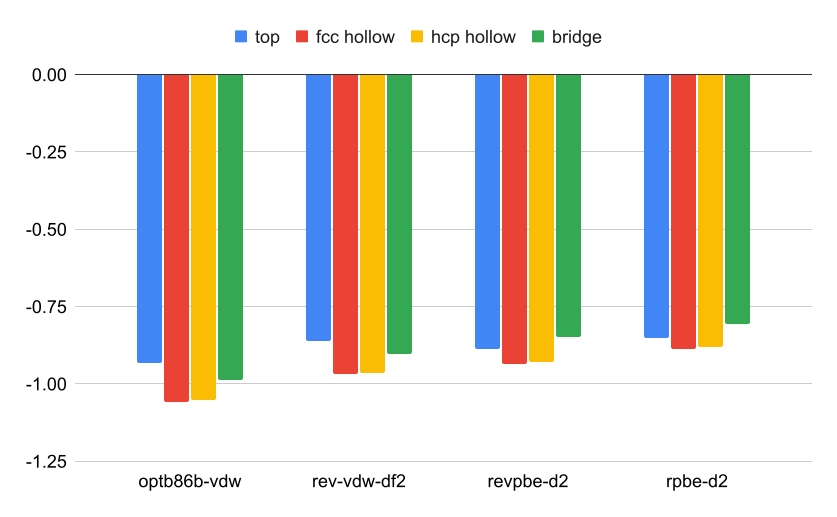
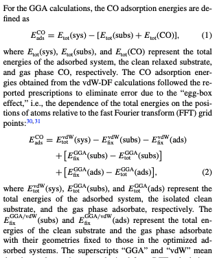

<style>
    h1{
      position: absolute;
      top: 50px; left:50px;
    }
    .split {
      display: table;
      width: 100%;
    }
    .split-item {
      display: table-cell;
      padding: 0px;
      width: 60%;
    }
    .split-left {
      position: relative;
    }
    .split-left__inner {
      height: 100%;
      position: fixed;
      width: 50%;
    }
    .split-right {
      position: relative;
    }
    .split-right__inner {
      height: 420px;
    }
    
</style>

<style>
  .katex {
    font-size: 90%;
  }
</style>
<style>
  section{
    font-size: 130%;
    margin: auto;
  }
</style>


# Find lattice constant
- Find FCC Cu lattice constant
- Using ASE, ASE-STATE-interface
  - ASE tutorial page: https://wiki.fysik.dtu.dk/ase/tutorials/lattice_constant.html
- Calculated 10 candidates of lattice constant, shifting gradually from the initial value 3.6 Å

Fit the energy using this expression(a: lattice constant)
$$
E(a) = p_{0}+p_{1} a+p_{2} a^{2}
$$


<table align="center">
<tr><td>optb86b-vdw<td>rev-vdw-df2<td>rebpbe-d2<td>rpbe-d2
<tr><td>3.6089 Å<td>3.6157 Å<td>3.6048 Å<td>3.6173 Å
</table>

---
## Code
```python
from state_interface.state import STATE
import os
import sys
from ase.build import bulk
from ase.io import Trajectory, read
import numpy as np

a0 = 3.6
eps = 0.01
traj = Trajectory('Cu.traj', 'w')
n_cpus = int(sys.argv[1])

energies = []
for i, a in enumerate(a0 * np.linspace(1 - eps, 1 + eps, 20)):
    slab = bulk('Cu', 'fcc', a=a)
    label = f'Cu{i}'
    input_file = f'{label}.in'
    output_file = f'{label}.out'
    pw_loc = './STATE'

    os.environ['ASE_STATE_COMMAND'] = f'mpirun -np {n_cpus} {pw_loc} < {input_file} > {output_file}'


    dft_calc = STATE(label=label, input_data=input_data)
    slab.calc = dft_calc
    energies.append(slab.get_potential_energy())
    traj.write(slab)

print(energies)
configs = read('Cu.traj@:')
a = np.array([2*config.cell[0, 1] for config in configs])
print(a)
# f(a) = p0 + p1*a + p2*a**2
functions = np.array([a**0, a, a**2])
p = np.linalg.lstsq(functions.T, energies, rcond=-1)[0]
#f'(a) = p1 + 2*p2*a 
p1 = p[1]
p2 = 2*p[2]
a0 = -p1/p2
print(a0)
```

---
## STATE parameters
```json:input_data
    input_data = {'WF_OPT'       :    'DAV' ,
                  'TYPE'         :       0  ,
                  'NSPG'         :       1  ,
                  'VERBOSITY'    :     'MEDIUM',
                  'GMAX'         :     6.00 ,
                  'GMAXP'        :     20.00 ,
                  'KPOINT_MESH'  : [16, 16, 16],
                  'KPOINT_SHIFT' : ['OFF', 'OFF', 'OFF'],
                  'NEG'          : 12,
                  'NSCF'         : 200,
                  'NSTEP'        : 200,
                  'TASK'         : 'SCF',
                  'WAY_MIX'      : 6,
                  'MIX_WHAT'     : 1,
                  'KBXMIX'       : 30,
                  'MIX_ALPHA'    : 0.5,
                  'DTIO'         : 100,
                  'IMDALG'       : 2,
                  'WIDTH'        : -0.0020,
                  'FORCCR'       : '1.00D-03',
                  'XCTYPE'        : 'optb86b',
                  'DESTM'        : 1.00,
                  'EDELTA'       : '1.00D-09',
                  'PSEUDOS'      : [
                                      ['Cu', 63.55, 'pot.Cu_pbe1'],
                                  ],
                  'VDW-DF'       : {'QCUT' : 10, 'NQ' : '20'}
                }
```

---

# Calculate adsorption energy

-  CO on Cu(111)


$$
E_{\mathrm{ads}}^{\mathrm{CO}}=E_{\mathrm{tot}}(\mathrm{sys})-\left[E_{\mathrm{tot}}(\mathrm{subs})+E_{\mathrm{tot}}(\mathrm{CO})\right]
$$


### CO adsorption energy on Cu(111) surface [eV]

||ontop|fcc hollow|hcp hollow|bridge|
|:-:|:-:|:-:|:-:|:-:|
|optb86b-vdw|-0.93|-1.06|-1.05|-0.99|
|rev-vdw-df2|-0.86|-0.97|-0.96|-0.90|
|revpbe-d2|-0.89|-0.94|-0.93|-0.85|
|rev-vdw-df2|-0.85|-0.89|-0.88|-0.81|





---


[https://aip.scitation.org/doi/10.1063/1.4887362](https://aip.scitation.org/doi/10.1063/1.4887362)