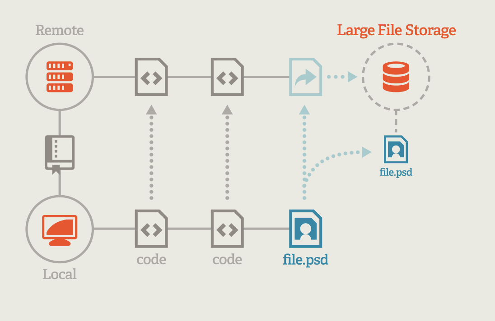

<h1>Database construction</h1>

<h3>Ryo ueda</h3>

---

# Cloud storage services
- [Amazon S3](https://aws.amazon.com/s3/)
  - [UI](https://s3.console.aws.amazon.com/s3/home?region=ap-northeast-1&region=ap-northeast-1) 
- [Google cloud storage](https://cloud.google.com/products/storage/?utm_source=google&utm_medium=cpc&utm_campaign=japac-AU-all-en-dr-bkws-all-pkws-trial-e-dr-1009882&utm_content=text-ad-none-none-DEV_c-CRE_505012141330-ADGP_Hybrid%20%7C%20BKWS%20-%20EXA%20%7C%20Txt%20~%20Storage%20~%20Cloud%20Storage_storage-general%20-%20Products-KWID_43700060418821300-kwd-11642151515&userloc_1009543-network_g&utm_term=KW_google%20cloud%20storage&gclid=CjwKCAiA1JGRBhBSEiwAxXblwUQeCESD56lMhzvdCJ7Fffr799HtHDZyOphKgBvcONUdq4pMesnJcxoCsckQAvD_BwE&gclsrc=aw.ds)
  - [UI](https://console.cloud.google.com/storage/browser?_ga=2.153594225.892478153.1646632486-341634914.1644489743&_gac=1.158975816.1646632508.CjwKCAiA1JGRBhBSEiwAxXblwUQeCESD56lMhzvdCJ7Fffr799HtHDZyOphKgBvcONUdq4pMesnJcxoCsckQAvD_BwE&project=zippy-world-296706&prefix=)
- Dropbox
- Google drive
- Github
  - Not very useful as storage 
  - Good for project management 

--- 
# [Git Large File Storage]([git-lfs](https://git-lfs.github.com/))
- Replace file entities with pointers and manage them with git
- Used to manage binaries (e.g. image files)
- Supported by Github
  - Free up to 1GB
  - $5/month for 50GB/month transfer + 50GB storage 
  -  [billing](https://docs.github.com/en/billing/managing-billing-for-git-large-file-storage/about-billing-for-git-large-file-storage)

- Git LFS server can be set up on another cloud storage(e.g. Amazon S3, Google Cloud storage)

---

# Database systems

- RDB(Relational Database)
  - Database management system
    - [Mysql](https://www.mysql.com/)
    - [PostgreSQL](https://www.postgresql.org/)
  - Operate with SQL
  - Supported by [ase.db](https://wiki.fysik.dtu.dk/ase/ase/db/db.html?highlight=db#module-ase.db)
- NoSQL
  - Key-value
    - [Redis](https://redis.io/)
    - [DynamoDB](https://aws.amazon.com/dynamodb/) 
  - Document database(JSON,XML)
    - [MongoDB](https://www.mongodb.com/)
  - Graph database
    - [Neo4j](https://neo4j.com/)  

---

# Web-interface
- https://uedar.github.io/database-sample/
- reference:[C2DB](https://cmrdb.fysik.dtu.dk/c2db/)

## Features to be implemented
- Search by specifying criteria
- Download json file
  - One by one from the detail page
  - Download in bulk from search results 
- Visualize atomic strucuture
