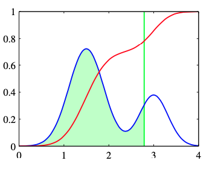
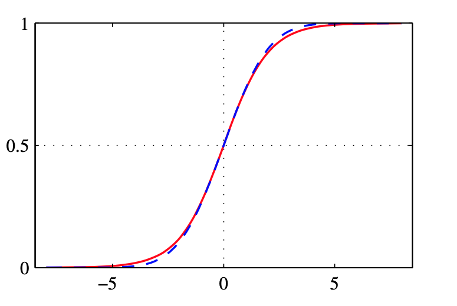
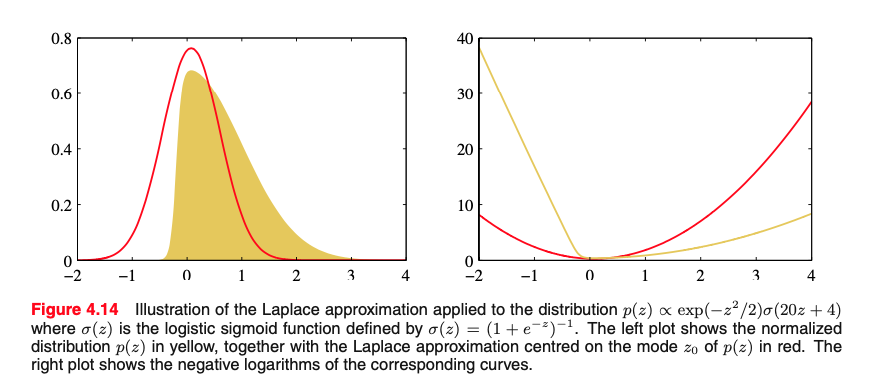

# 4.3.5 Probit regression
Remain within the frame- work of generalized linear models(two-class classification)
$$
p(t=1 \mid a)=f(a)
$$

$a=\mathbf{w}^{\mathrm{T}} \phi$  and $f(\cdot)$ is activation function.

$$\begin{cases}t_{n}=1 & \text { if } a_{n} \geqslant \theta \\ t_{n}=0 & \text { otherwise. }\end{cases}$$

■ $p(\theta)$: probability density
■ $\Phi(a)$: cumulative distribution function

- $\Phi(a)=\int_{-\infty}^{a} p(\theta) \mathrm{d} \theta$
- when $p(\theta) \sim \mathcal{N}(0, 1)$ =>  `probit function`
- cumulative distribution function is equivalent to activation function.

---
# Exercise 4.21

 
Show that the probit function (4.114) and the erf function (4.115) are related by (4.116).

$$
\begin{aligned}
\Phi(a) &= \int_{-\infty}^{a} \mathcal{N}(\theta \mid 0,1) \mathrm{d} \theta \\
&=\frac{1}{2}+\int_{0}^{a} \mathcal{N}(\theta \mid 0,1) d \theta \\
&=\frac{1}{2}+\frac{1}{\sqrt{2 \pi}} \int_{0}^{a} \exp \left(-\theta^{2} / 2\right) d \theta \\
\end{aligned}
$$

Replace $\theta = \sqrt{2} \theta^{\prime}$

$$
\begin{aligned}
&=\frac{1}{2}+\frac{1}{\sqrt{\pi}} \int_{0}^{a/\sqrt{2}} \exp \left(-\theta^{\prime 2} \right) d \theta^{\prime} \\
&=\frac{1}{2}\left\{1+ \operatorname{erf}(\frac{a}{\sqrt{2}})\right\}
\end{aligned}
$$

$
\operatorname{erf}(a)=\frac{2}{\sqrt{\pi}} \int_{0}^{a} \exp \left(-\theta^{2}\right) \mathrm{d} \theta
$

---

# 4.3.5 Probit regression
■ $\sigma(a)$: logistic function
$\sigma(a)=\frac{1}{1+\exp (-a)}$
■ $\Phi(\lambda a)$: probit function(scaling factor $\lambda = \frac{\pi^2}{8}$) 
$\Phi(a)=\frac{1}{2}\left\{1+\frac{1}{\sqrt{2}} \operatorname{erf}(a)\right\}$

- logistic regression: decay like $exp(-x)$
- probit regression: decay like $exp(-x^2)$
  - => more sensitive to outlier 

---

# 4.3.6 Canonical link functions

Assumption of exponential family distribution to the target variable t
$$
p(t \mid \eta, s)=\frac{1}{s} h\left(\frac{t}{s}\right) g(\eta) \exp \left\{\frac{\eta t}{s}\right\}
$$

Log likelihood 

$$
\ln p(\mathbf{t} \mid \eta, s)=\sum_{n=1}^{N} \ln p\left(t_{n} \mid \eta, s\right)=\sum_{n=1}^{N}\left\{\ln g\left(\eta_{n}\right)+\frac{\eta_{n} t_{n}}{s}\right\}+\text { const }
$$
Dervative of the log likelihood with respect to the model parameters w 
$$
\begin{aligned}
\nabla_{\mathbf{w}} \ln p(\mathbf{t} \mid \eta, s) &=\sum_{n=1}^{N}\left\{\frac{d}{d \eta_{n}} \ln g\left(\eta_{n}\right)+\frac{t_{n}}{s}\right\} \frac{d \eta_{n}}{d y_{n}} \frac{d y_{n}}{d a_{n}} \nabla a_{n} \\
&=\sum_{n=1}^{N} \frac{1}{s}\left\{t_{n}-y_{n}\right\} \psi^{\prime}\left(y_{n}\right) f^{\prime}\left(a_{n}\right) \boldsymbol{\phi}_{n}
\end{aligned}
$$

what is canonical link functions $y=f\left(\mathbf{w}^{\mathrm{T}} \boldsymbol{\phi}\right)$, $f^{-1}(y)=\psi(y)$

$$
\nabla \ln E(\mathbf{w})=\frac{1}{s} \sum_{n=1}^{N}\left\{y_{n}-t_{n}\right\} \phi_{n}
$$

<!-- ---
$$
p(t \mid \eta, s)=\frac{1}{s} h\left(\frac{t}{s}\right) g(\eta) \exp \left\{\frac{\eta t}{s}\right\}
$$

$$
y \equiv \mathbb{E}[t \mid \eta]=-s \frac{d}{d \eta} \ln g(\eta)
$$ -->
---

# 4.4 The Laplace Approximation

<!-- $$
p(z)=\frac{1}{Z}
$$

$$
\left.\frac{d f(z)}{d z}\right|_{z=z_{0}}=0
$$ -->
Approximate the posterior distribution of logistic regression with Gaussian $p(z) = \frac{f(z)}{Z}$ 
($Z$ = normalize coefficient)
  => Integrate the posterior probability with parameter $w$, we can obtain the predictive distribution(discussed in section(3.3))

Taylor expansion of $\ln f(z)$ centred on the mode $z0$

$$
\ln f(z) \simeq \ln f\left(z_{0}\right)-\frac{1}{2} A\left(z-z_{0}\right)^{2}
$$

$$
A=-\left.\frac{d^{2}}{d z^{2}} \ln f(z)\right|_{z=z_{0}}
$$

$$
f(z) \simeq f\left(z_{0}\right) \exp \left\{-\frac{A}{2}\left(z-z_{0}\right)^{2}\right\}
$$

Normalized distribution 
$$
q(z)=\left(\frac{A}{2 \pi}\right)^{1 / 2} \exp \left\{-\frac{A}{2}\left(z-z_{0}\right)^{2}\right\}
$$

<!-- ---
# 4.4 The Laplace Approximation

$$
\ln f(\mathbf{z}) \simeq \ln f\left(\mathbf{z}_{0}\right)-\frac{1}{2}\left(\mathbf{z}-\mathbf{z}_{0}\right)^{\mathrm{T}} \mathbf{A}\left(\mathbf{z}-\mathbf{z}_{0}\right)
$$

$$
f(\mathbf{z}) \simeq f\left(\mathbf{z}_{0}\right) \exp \left\{-\frac{1}{2}\left(\mathbf{z}-\mathbf{z}_{0}\right)^{\mathrm{T}} \mathbf{A}\left(\mathbf{z}-\mathbf{z}_{0}\right)\right\}
$$

$$
q(\mathbf{z})=\frac{|\mathbf{A}|^{1 / 2}}{(2 \pi)^{M / 2}} \exp \left\{-\frac{1}{2}\left(\mathbf{z}-\mathbf{z}_{0}\right)^{\mathrm{T}} \mathbf{A}\left(\mathbf{z}-\mathbf{z}_{0}\right)\right\}=\mathcal{N}\left(\mathbf{z} \mid \mathbf{z}_{0}, \mathbf{A}^{-1}\right)
$$ -->

<!-- $$
\begin{aligned}
Z &=\int f(\mathbf{z}) \mathrm{d} \mathbf{z} \\
& \simeq f\left(\mathbf{z}_{0}\right) \int \exp \left\{-\frac{1}{2}\left(\mathbf{z}-\mathbf{z}_{0}\right)^{\mathrm{T}} \mathbf{A}\left(\mathbf{z}-\mathbf{z}_{0}\right)\right\} \mathrm{d} \mathbf{z} \\
&=f\left(\mathbf{z}_{0}\right) \frac{(2 \pi)^{M / 2}}{|\mathbf{A}|^{1 / 2}}
\end{aligned}
$$ -->

---
# 4.4 The Laplace Approximation

### Advantages
- Simple to calculate
- Approximation by Gaussian distribution will be more accurate if there is more data (`the central limit theorem`)
### Disadvantages
- Only applicable to real variables
- Difficult to choose which mode to use when multimodal distribution

■ : $p(z) \propto \exp \left(-z^{2} / 2\right) \sigma(20 z+4)$
■ : Laplace approximation of $p(z)$

---

# 4.4.1 Model comparison and BIC
Using laplace approximation to the normalization constant $Z$
$$
\begin{aligned}
Z &=\int f(\mathbf{z}) \mathrm{d} \mathbf{z} \\
& \simeq f\left(\mathbf{z}_{0}\right) \int \exp \left\{-\frac{1}{2}\left(\mathbf{z}-\mathbf{z}_{0}\right)^{\mathrm{T}} \mathbf{A}\left(\mathbf{z}-\mathbf{z}_{0}\right)\right\} \mathrm{d} \mathbf{z} \\
&=f\left(\mathbf{z}_{0}\right) \frac{(2 \pi)^{M / 2}}{|\mathbf{A}|^{1 / 2}}
\end{aligned}
$$

  

Consider a data set $D$ and a set of models $\{M_i\}$ having parameters $\{θ_i\}$
Model evidence $p\left(\mathcal{D} \mid \mathcal{M}_{i}\right)$ (omit $M_i$)
$$
p(\mathcal{D})=\int p(\mathcal{D} \mid \boldsymbol{\theta}) p(\boldsymbol{\theta}) \mathrm{d} \boldsymbol{\theta}
$$

$$
\ln p(\mathcal{D}) \simeq \ln p\left(\mathcal{D} \mid \boldsymbol{\theta}_{\mathrm{MAP}}\right)+\ln p\left(\boldsymbol{\theta}_{\mathrm{MAP}}\right)+\frac{M}{2} \ln (2 \pi)-\frac{1}{2} \ln |\mathbf{A}|
$$

$
\mathbf{A}=-\nabla \nabla \ln p\left(\mathcal{D} \mid \boldsymbol{\theta}_{\mathrm{MAP}}\right) p\left(\boldsymbol{\theta}_{\mathrm{MAP}}\right)=-\nabla \nabla \ln p\left(\boldsymbol{\theta}_{\mathrm{MAP}} \mid \mathcal{D}\right)
$
  

  

Assume that the Gaussian prior distribution over parameters is broad, and that the Hessian has full rank

BIC(Bayesian Information Criterion)
$$
\ln p(\mathcal{D}) \simeq \ln p\left(\mathcal{D} \mid \boldsymbol{\theta}_{\mathrm{MAP}}\right)-\frac{1}{2} M \ln N
$$

- BIC penalizes model complexity more heavily than AIC($\operatorname{ln} p\left(D \mid \theta_{\mathrm{MAP}}\right)-M$)
  

---
# Exercise 4.22
Using the result (4.135), derive the expression (4.137) for the log model evidence under the Laplace approximation.
 
 
$$
\begin{aligned}
p(D) &=\int p(D \mid \boldsymbol{\theta}) p(\boldsymbol{\theta}) d \boldsymbol{\theta}=\int f(\boldsymbol{\theta}) d \boldsymbol{\theta} \\
&=f\left(\boldsymbol{\theta}_{M A P}\right) \frac{(2 \pi)^{M / 2}}{|\mathbf{A}|^{1 / 2}} \\
&=p\left(D \mid \boldsymbol{\theta}_{M A P}\right) p\left(\boldsymbol{\theta}_{M A P}\right) \frac{(2 \pi)^{M / 2}}{|\mathbf{A}|^{1 / 2}}
\end{aligned}
$$

$$
\ln p(D)=\ln p\left(D \mid \boldsymbol{\theta}_{M A P}\right)+\ln p\left(\boldsymbol{\theta}_{M A P}\right)+\frac{M}{2} \ln 2 \pi-\frac{1}{2} \ln |\mathbf{A}|
$$

- $M$: Dimension of parameter $\theta$
- $\theta_{MAP}$: mode of $f(\theta)$

---
# Exercise 4.23

BIC expression (4.139)
$$
\ln p(\mathcal{D}) \simeq \ln p\left(\mathcal{D} \mid \boldsymbol{\theta}_{\mathrm{MAP}}\right)-\frac{1}{2} M \ln N
$$
---

$$
\begin{aligned}
\ln p(D)\simeq & \ln p\left(D \mid \boldsymbol{\theta}_{MAP}\right)+\ln p\left(\boldsymbol{\theta}_{M A P}\right)+\frac{M}{2} \ln 2 \pi-\frac{1}{2} \ln |\mathbf{A}| \\
=& \ln p\left(D \mid \boldsymbol{\theta}_{MAP}\right)-\frac{M}{2} \ln 2 \pi-\frac{1}{2} \ln \left|\mathbf{V}_{0}\right|-\frac{1}{2}\left(\boldsymbol{\theta}_{MAP}-\mathbf{m}\right)^{T} \mathbf{V}_{0}{ }^{-1}\left(\boldsymbol{\theta}_{MAP}-\mathbf{m}\right) \\
&+\frac{M}{2} \ln 2 \pi-\frac{1}{2} \ln |\mathbf{A}| \\
=& \ln p\left(D \mid \boldsymbol{\theta}_{MAP}\right)-\frac{1}{2} \ln \left|\mathbf{V}_{0}\right|-\frac{1}{2}\left(\boldsymbol{\theta}_{MAP}-\mathbf{m}\right)^{T} \mathbf{V}_{0}{ }^{-1}\left(\boldsymbol{\theta}_{MAP}-\mathbf{m}\right)-\frac{1}{2} \ln |\mathbf{A}|
\end{aligned}
$$

  

$$\begin{aligned}
\mathbf{A} &=-\nabla \nabla \ln p\left(D \mid \boldsymbol{\theta}\right) p\left(\boldsymbol{\theta}\right) |_{\theta={\theta}_{\boldsymbol{MAP}}} \\
&=-\nabla \nabla \ln p\left(D \mid \boldsymbol{\theta}\right)|_{\theta={\theta}_{\boldsymbol{MAP}}} -\nabla \nabla \ln p\left(\boldsymbol{\theta}\right)|_{\theta={\theta}_{\boldsymbol{MAP}}} \\
&=\mathbf{H}-\nabla \nabla\left\{-\frac{1}{2}\left(\boldsymbol{\theta} -\mathbf{m}\right)^{T} \mathbf{V}_{\mathbf{0}}^{-1}\left(\boldsymbol{\theta}-\mathbf{m}\right)\right\}|_{\theta={\theta}_{\boldsymbol{MAP}}} \\
&=\mathbf{H}+\nabla\left\{\mathbf{V}_{\mathbf{0}}{ }^{-1}\left(\boldsymbol{\theta}-\mathbf{m}\right)\right\}|_{\theta={\theta}_{\boldsymbol{MAP}}} \\
&=\mathbf{H}+\mathbf{V}_{\mathbf{0}}^{-1}
\end{aligned}$$

  

  

$$
\begin{aligned}
&\ln \left\{\left|\mathbf{V}_{0}\right| \cdot\left|\mathbf{H}+\mathbf{V}_{0}^{-1}\right|\right\} \\
& = \ln \left\{\left|\mathbf{V}_{0} \mathbf{H}+\mathbf{I}\right|\right\} \\
& = \ln \left|\mathbf{V}_{0}\right| + \ln |\mathbf{H}| \\
\end{aligned}
$$

  

$
\mathbf{H}=\sum_{n=1}^{N} \mathbf{H}_{\mathbf{n}}=N \hat{\mathbf{H}}
$ 

$$
\begin{aligned}
\ln p(D) &= \ln p\left(D \mid \boldsymbol{\theta}_{M A P}\right)-\frac{1}{2}\left(\boldsymbol{\theta}_{M A P}-\mathbf{m}\right)^{T} \mathbf{V}_{0}^{-1}\left(\boldsymbol{\theta}_{M A P}-\mathbf{m}\right)-\frac{1}{2} \ln |\mathbf{H}|-  \ln \left|\mathbf{V}_{0}\right| \\
&= \ln p\left(D \mid \boldsymbol{\theta}_{M A P}\right)-\frac{1}{2}\left(\boldsymbol{\theta}_{M A P}-\mathbf{m}\right)^{T} \mathbf{V}_{0}^{-1}\left(\boldsymbol{\theta}_{M A P}-\mathbf{m}\right)-\frac{1}{2} \ln |N \widehat{\mathbf{H}}|- \ln \left|\mathbf{V}_{0}\right| \\ 
&= \ln p\left(D \mid \boldsymbol{\theta}_{M A P}\right)-\frac{1}{2}\left(\boldsymbol{\theta}_{M A P}-\mathbf{m}\right)^{T} \mathbf{V}_{0}^{-1}\left(\boldsymbol{\theta}_{M A P}-\mathbf{m}\right)-\frac{M}{2} \ln N-\frac{1}{2} \ln |\widehat{\mathbf{H}}|-0\ln \left|\mathbf{V}_{0}\right| \\ 
N>>1 \\
& \approx \ln p\left(D \mid \boldsymbol{\theta}_{M A P}\right)-\frac{M}{2} \ln N
\end{aligned}
$$