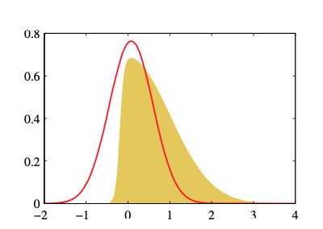

 
# 4.3.5 Probit regression

$$
\begin{aligned}
\Phi(a) &= \int_{-\infty}^{a} \mathcal{N}(\theta \mid 0,1) \mathrm{d} \theta \\
&=\frac{1}{2}+\int_{0}^{a} \mathcal{N}(\theta \mid 0,1) d \theta \\
&=\frac{1}{2}+\frac{1}{\sqrt{2 \pi}} \int_{0}^{a} \exp \left(-\theta^{2} / 2\right) d \theta \\
\end{aligned}
$$

replace $\theta = \sqrt{2} \theta^{\prime}$

$$
\begin{aligned}
&=\frac{1}{2}+\frac{1}{\sqrt{\pi}} \int_{0}^{a/\sqrt{2}} \exp \left(-\theta^{\prime 2} \right) d \theta^{\prime} \\
&=\frac{1}{2}\left\{1+ \operatorname{erf}(\frac{a}{\sqrt{2}})\right\}
\end{aligned}
$$

$
\operatorname{erf}(a)=\frac{2}{\sqrt{\pi}} \int_{0}^{a} \exp \left(-\theta^{2}\right) \mathrm{d} \theta
$

---
# 4.3.5 Probit regression

- aaa
- bbb
- 
---

# 4.3.5 Probit regression
$\sigma(a)=\frac{1}{1+\exp (-a)}$

---

$$
\begin{aligned}
p(t \mid \mathbf{x}) &=(1-\epsilon) \sigma(\mathbf{x})+\epsilon(1-\sigma(\mathbf{x})) \\
&=\epsilon+(1-2 \epsilon) \sigma(\mathbf{x})
\end{aligned}
$$
---

# 4.3.6 Canonical link functions

$$
p(t \mid \eta, s)=\frac{1}{s} h\left(\frac{t}{s}\right) g(\eta) \exp \left\{\frac{\eta t}{s}\right\}
$$

$$
y \equiv \mathbb{E}[t \mid \eta]=-s \frac{d}{d \eta} \ln g(\eta)
$$

$$
y=f\left(\mathbf{w}^{\mathrm{T}} \boldsymbol{\phi}\right)
$$

$$
\ln p(\mathbf{t} \mid \eta, s)=\sum_{n=1}^{N} \ln p\left(t_{n} \mid \eta, s\right)=\sum_{n=1}^{N}\left\{\ln g\left(\eta_{n}\right)+\frac{\eta_{n} t_{n}}{s}\right\}+\text { const }
$$

---

$$
\begin{aligned}
\nabla_{\mathbf{w}} \ln p(\mathbf{t} \mid \eta, s) &=\sum_{n=1}^{N}\left\{\frac{d}{d \eta_{n}} \ln g\left(\eta_{n}\right)+\frac{t_{n}}{s}\right\} \frac{d \eta_{n}}{d y_{n}} \frac{d y_{n}}{d a_{n}} \nabla a_{n} \\
&=\sum_{n=1}^{N} \frac{1}{s}\left\{t_{n}-y_{n}\right\} \psi^{\prime}\left(y_{n}\right) f^{\prime}\left(a_{n}\right) \boldsymbol{\phi}_{n}
\end{aligned}
$$

$$
f^{-1}(y)=\psi(y)
$$

$$
\nabla \ln E(\mathbf{w})=\frac{1}{s} \sum_{n=1}^{N}\left\{y_{n}-t_{n}\right\} \phi_{n}
$$

---

$$
p(z)=\frac{1}{Z}
$$

$$
\left.\frac{d f(z)}{d z}\right|_{z=z_{0}}=0
$$

$$
\ln f(z) \simeq \ln f\left(z_{0}\right)-\frac{1}{2} A\left(z-z_{0}\right)^{2}
$$

$$
A=-\left.\frac{d^{2}}{d z^{2}} \ln f(z)\right|_{z=z_{0}}
$$

$$
f(z) \simeq f\left(z_{0}\right) \exp \left\{-\frac{A}{2}\left(z-z_{0}\right)^{2}\right\}
$$

---
$$
q(z)=\left(\frac{A}{2 \pi}\right)^{1 / 2} \exp \left\{-\frac{A}{2}\left(z-z_{0}\right)^{2}\right\}
$$

$$
\ln f(\mathbf{z}) \simeq \ln f\left(\mathbf{z}_{0}\right)-\frac{1}{2}\left(\mathbf{z}-\mathbf{z}_{0}\right)^{\mathrm{T}} \mathbf{A}\left(\mathbf{z}-\mathbf{z}_{0}\right)
$$

$$
f(\mathbf{z}) \simeq f\left(\mathbf{z}_{0}\right) \exp \left\{-\frac{1}{2}\left(\mathbf{z}-\mathbf{z}_{0}\right)^{\mathrm{T}} \mathbf{A}\left(\mathbf{z}-\mathbf{z}_{0}\right)\right\}
$$

$$
q(\mathbf{z})=\frac{|\mathbf{A}|^{1 / 2}}{(2 \pi)^{M / 2}} \exp \left\{-\frac{1}{2}\left(\mathbf{z}-\mathbf{z}_{0}\right)^{\mathrm{T}} \mathbf{A}\left(\mathbf{z}-\mathbf{z}_{0}\right)\right\}=\mathcal{N}\left(\mathbf{z} \mid \mathbf{z}_{0}, \mathbf{A}^{-1}\right)
$$

---
# 4.4 The Laplace Approximation

---
# 4.4.1 Model comparison and BIC

$$
\begin{aligned}
Z &=\int f(\mathbf{z}) \mathrm{d} \mathbf{z} \\
& \simeq f\left(\mathbf{z}_{0}\right) \int \exp \left\{-\frac{1}{2}\left(\mathbf{z}-\mathbf{z}_{0}\right)^{\mathrm{T}} \mathbf{A}\left(\mathbf{z}-\mathbf{z}_{0}\right)\right\} \mathrm{d} \mathbf{z} \\
&=f\left(\mathbf{z}_{0}\right) \frac{(2 \pi)^{M / 2}}{|\mathbf{A}|^{1 / 2}}
\end{aligned}
$$

$$
p(\mathcal{D})=\int p(\mathcal{D} \mid \boldsymbol{\theta}) p(\boldsymbol{\theta}) \mathrm{d} \boldsymbol{\theta}
$$

$$
\ln p(\mathcal{D}) \simeq \ln p\left(\mathcal{D} \mid \boldsymbol{\theta}_{\mathrm{MAP}}\right)+\ln p\left(\boldsymbol{\theta}_{\mathrm{MAP}}\right)+\frac{M}{2} \ln (2 \pi)-\frac{1}{2} \ln |\mathbf{A}|
$$
---
$$
\mathbf{A}=-\nabla \nabla \ln p\left(\mathcal{D} \mid \boldsymbol{\theta}_{\mathrm{MAP}}\right) p\left(\boldsymbol{\theta}_{\mathrm{MAP}}\right)=-\nabla \nabla \ln p\left(\boldsymbol{\theta}_{\mathrm{MAP}} \mid \mathcal{D}\right)
$$

$$
\ln p(\mathcal{D}) \simeq \ln p\left(\mathcal{D} \mid \boldsymbol{\theta}_{\mathrm{MAP}}\right)-\frac{1}{2} M \ln N
$$

---
# Exercise 4.22

$$
\begin{aligned}
p(D) &=\int p(D \mid \boldsymbol{\theta}) p(\boldsymbol{\theta}) d \boldsymbol{\theta}=\int f(\boldsymbol{\theta}) d \boldsymbol{\theta} \\
&=f\left(\boldsymbol{\theta}_{M A P}\right) \frac{(2 \pi)^{M / 2}}{|\mathbf{A}|^{1 / 2}} \\
&=p\left(D \mid \boldsymbol{\theta}_{M A P}\right) p\left(\boldsymbol{\theta}_{M A P}\right) \frac{(2 \pi)^{M / 2}}{|\mathbf{A}|^{1 / 2}}
\end{aligned}
$$

$$
\ln p(D)=\ln p\left(D \mid \boldsymbol{\theta}_{M A P}\right)+\ln p\left(\boldsymbol{\theta}_{M A P}\right)+\frac{M}{2} \ln 2 \pi-\frac{1}{2} \ln |\mathbf{A}|
$$

---
# Exercise 4.23

$$
\begin{aligned}
\ln p(D)=& \ln p\left(D \mid \boldsymbol{\theta}_{M A P}\right)+\ln p\left(\boldsymbol{\theta}_{M A P}\right)+\frac{M}{2} \ln 2 \pi-\frac{1}{2} \ln |\mathbf{A}| \\
=& \ln p\left(D \mid \boldsymbol{\theta}_{M A P}\right)-\frac{M}{2} \ln 2 \pi-\frac{1}{2} \ln \left|\mathbf{V}_{0}\right|-\frac{1}{2}\left(\boldsymbol{\theta}_{M A P}-\mathbf{m}\right)^{T} \mathbf{V}_{0}{ }^{-1}\left(\boldsymbol{\theta}_{M A P}-\mathbf{m}\right) \\
&+\frac{M}{2} \ln 2 \pi-\frac{1}{2} \ln |\mathbf{A}| \\
=& \ln p\left(D \mid \boldsymbol{\theta}_{M A P}\right)-\frac{1}{2} \ln \left|\mathbf{V}_{0}\right|-\frac{1}{2}\left(\boldsymbol{\theta}_{M A P}-\mathbf{m}\right)^{T} \mathbf{V}_{0}{ }^{-1}\left(\boldsymbol{\theta}_{M A P}-\mathbf{m}\right)-\frac{1}{2} \ln |\mathbf{A}|
\end{aligned}
$$

$$
\begin{aligned}
\mathbf{A} &=-\nabla \nabla \ln p\left(D \mid \boldsymbol{\theta}\right) p\left(\boldsymbol{\theta}\right) |_{\theta={\theta}_{\boldsymbol{M A P}}} \\
&=-\nabla \nabla \ln p\left(D \mid \boldsymbol{\theta}\right)|_{\theta={\theta}_{\boldsymbol{M A P}}} -\nabla \nabla \ln p\left(\boldsymbol{\theta}\right)|_{\theta={\theta}_{\boldsymbol{M A P}}} \\
&=\mathbf{H}-\nabla \nabla\left\{-\frac{1}{2}\left(\boldsymbol{\theta} -\mathbf{m}\right)^{T} \mathbf{V}_{\mathbf{0}}^{-1}\left(\boldsymbol{\theta}-\mathbf{m}\right)\right\}|_{\theta={\theta}_{\boldsymbol{M A P}}} \\
&=\mathbf{H}+\nabla\left\{\mathbf{V}_{\mathbf{0}}{ }^{-1}\left(\boldsymbol{\theta}-\mathbf{m}\right)\right\}|_{\theta={\theta}_{\boldsymbol{M A P}}} \\
&=\mathbf{H}+\mathbf{V}_{\mathbf{0}}^{-1}
\end{aligned}
$$

---

$$
\begin{aligned}
&\ln \left\{\left|\mathbf{V}_{0}\right| \cdot\left|\mathbf{H}+\mathbf{V}_{0}^{-1}\right|\right\} \\
&\ln \left\{\left|\mathbf{V}_{0} \mathbf{H}+\mathbf{I}\right|\right\} \\
&\ln \left|\mathbf{V}_{0}\right|-\frac{1}{2} \ln |\mathbf{H}| \\
&\ln |\mathbf{H}|+\text { const }
\end{aligned}
$$

$$
\mathbf{H}=\sum_{n=1}^{N} \mathbf{H}_{\mathbf{n}}=N \hat{\mathbf{H}}
$$ 